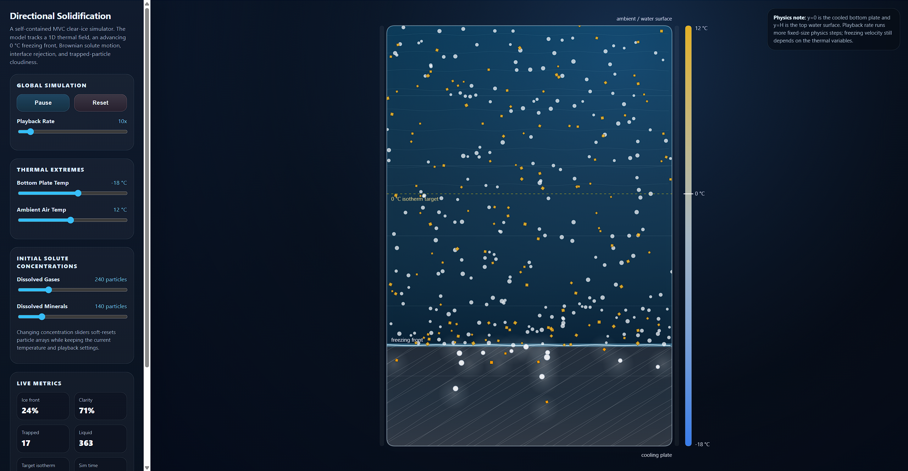
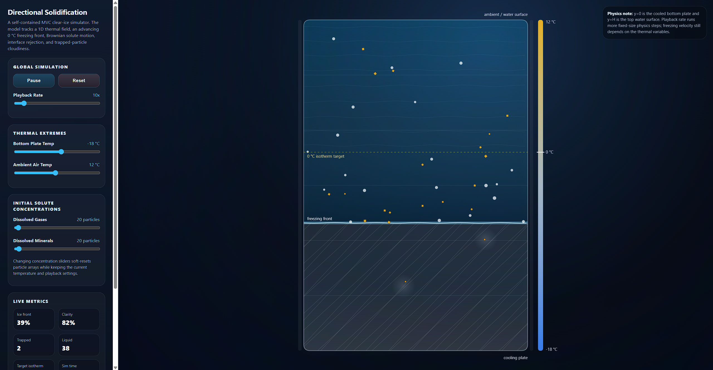
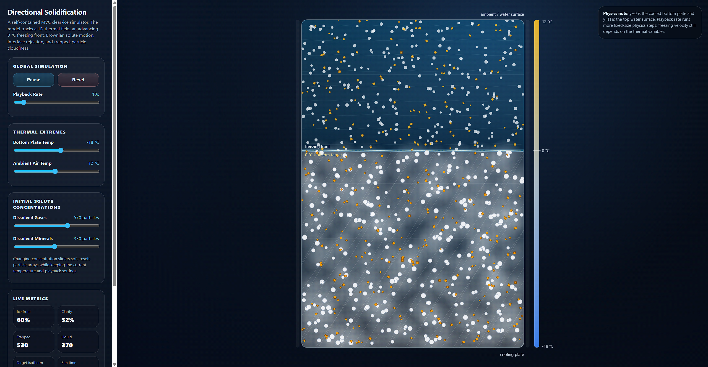

# Directional Solidification & Clear Ice Simulator

A self-contained, interactive browser widget that demonstrates the directional solidification process used to make clear ice. The simulator models a two-dimensional cross-section of water freezing upward from a cooled bottom plate, while dissolved gases and mineral impurities diffuse, accumulate near the freezing interface, and may become trapped in the growing ice.

The entire application is contained in a single HTML file and runs locally in any modern browser. It uses no external dependencies, no build process, no server, and no package manager.

---

## Screenshot Gallery

Add screenshots of the widget in action here.

### 1. Default simulation state



Suggested capture: the widget shortly after launch, showing the control panel, water column, temperature bar, and early ice front.

### 2. Clear ice formation with low solute concentration



Suggested capture: lower gas and mineral sliders, with relatively transparent ice and a high clarity metric.

### 3. Cloudy ice from trapped impurities



Suggested capture: high gas and mineral sliders, showing a denser cloudiness field in the solid region.

---

## Project Overview

This widget is designed as a teaching and exploration tool for clear ice formation. It visualizes the key idea behind directional freezing: when water freezes from one side, the solidification front can reject impurities into the remaining liquid. If the freezing proceeds in a controlled direction, dissolved gases and minerals are pushed ahead of the advancing ice rather than being uniformly trapped throughout it. This is one reason directional freezing can produce clearer ice than freezing a container from all sides at once.

The simulator focuses on three coupled ideas:

1. A one-dimensional vertical thermal gradient.
2. A horizontal solid-liquid interface that advances upward from the bottom.
3. Discrete impurity particles that diffuse, pile up near the interface, and may become trapped if local concentration becomes too high.

The model is intentionally lightweight so that it can run smoothly in a browser using the HTML5 Canvas API.

---

## Features

### Single-file deployment

- One `index.html` file contains all HTML, CSS, and JavaScript.
- No external CSS links.
- No `<script src="...">` tags.
- No third-party JavaScript libraries.
- No server required.
- Runs by opening the HTML file directly in a browser.

### Interactive physics controls

The sidebar exposes live controls for:

- Play and pause.
- Reset.
- Playback rate from 1x to 100x.
- Bottom plate temperature.
- Ambient air temperature.
- Initial dissolved gas particle count.
- Initial dissolved mineral particle count.

Temperature sliders update the thermal model in real time. Concentration sliders trigger a soft reset of the particle population while preserving the current thermal and playback settings.

### Visual simulation output

The canvas renders:

- Liquid water as a semi-transparent blue gradient.
- Solid ice as a crystalline pale-blue/white region growing from the bottom.
- A white horizontal freezing front.
- A dashed target 0 deg C isotherm.
- A vertical temperature color bar.
- Gas particles as small pale circular bubbles.
- Mineral particles as orange square particles.
- Cloudiness in the solid ice based on trapped impurity density.

### Live metrics

The widget reports:

- Ice front height as a percentage of the domain.
- Target isotherm height as a percentage of the domain.
- Estimated clarity percentage.
- Number of trapped particles.
- Number of particles still in liquid.
- Simulated elapsed time.

---

## Underlying Physics Model

The simulator is not a full computational fluid dynamics or phase-field model. It is a compact educational model designed to preserve the main qualitative behaviors of directional solidification while remaining fast enough for real-time browser interaction.

### Coordinate system

The simulation domain is a two-dimensional rectangle.

- `y = 0` represents the bottom cooling plate.
- `y = H` represents the top water surface exposed to ambient air.
- The left and right walls are treated as perfectly insulated.
- Because the side walls are insulated, temperature is modeled as a function of vertical position only.

Particles move in both x and y, but the temperature field depends only on y.

### Linear thermal gradient

The temperature field is assumed to be perfectly linear between the bottom plate and the top surface:

```text
T(y) = T_cool + (y / H) * (T_ambient - T_cool)
```

where:

- `T(y)` is the temperature at height `y`.
- `T_cool` is the bottom plate temperature.
- `T_ambient` is the top ambient temperature.
- `H` is the total domain height.

This is a simplified steady-state approximation. It intentionally avoids solving the transient heat equation so that the model remains simple, deterministic in structure, and easy to inspect.

### Freezing front and target isotherm

The phase boundary is associated with the location where the linear temperature field crosses the freezing temperature:

```text
T(y) = T_freeze
```

The widget uses `T_freeze = 0 deg C`. Solving the linear gradient for the target front height gives:

```text
y_target = H * (T_freeze - T_cool) / (T_ambient - T_cool)
```

with clamping at the bottom and top of the domain.

The rendered freezing front does not teleport immediately to `y_target`. Instead, the simulated front advances toward that target at a finite rate determined by the thermal settings. This creates visible solidification dynamics while preserving the role of the thermodynamic variables.

### Front velocity

The implementation computes a maximum front advancement rate from approximate cooling and gradient-strength terms:

```text
coolingStrength = clamp((T_freeze - T_cool) / 40, 0, 1)
gradientStrength = clamp((T_ambient - T_cool) / 65, 0.08, 1.25)
maxRate = baseRate * (0.35 + 1.8 * coolingStrength) * gradientStrength
```

The front advances toward the target isotherm by no more than `maxRate * dt` in each fixed physics step.

This means the physical freezing behavior depends on the temperature controls, not on the playback-rate slider.

### Fixed-step integration and playback rate

The simulation uses fixed-step time integration:

```text
FIXED_PHYSICS_DT = 1 / 60 seconds
```

The playback-rate slider changes how many fixed-size physics steps are executed per real wall-clock second. It does not increase the size of the physics timestep.

This distinction is important. Earlier versions of the widget used the speed slider as a direct multiplier on `dt`, which could alter Brownian motion, local solute pile-up, and trapping statistics. The current version avoids that by keeping the physics step fixed and only changing how quickly simulated time advances relative to real time.

If the browser cannot keep up, the widget drops excess accumulated backlog rather than increasing `dt`. This preserves the physics model and merely slows apparent playback under load.

### Solute particles

Water molecules are treated as a continuous background. Only impurities are represented as discrete particles.

The model includes two particle species:

#### Dissolved gases

- Rendered as pale circular particles.
- High tendency to form bubbles or cloudy inclusions.
- Very low partition coefficient.
- Higher Brownian diffusivity.
- Larger rejection distance when pushed ahead of the interface.

Current model parameters:

```text
D_liquid = 62
D_solid = 0
k = 0.035
```

#### Dissolved minerals

- Rendered as orange square particles.
- Moderate partition coefficient.
- Lower Brownian diffusivity than gas particles.
- More likely than gases to be incorporated into the solid phase.

Current model parameters:

```text
D_liquid = 21
D_solid = 0
k = 0.22
```

These constants are illustrative, not calibrated to a specific real-world water chemistry.

### Brownian motion in liquid water

Particles in the liquid phase undergo a random walk. For each fixed physics step, the Brownian displacement scale is:

```text
sigma = sqrt(2 * D_liquid * dt)
```

The simulator samples normally distributed random displacements in x and y. Particles reflect off the side boundaries and remain within the liquid domain unless trapped.

### Interface rejection

When the solidification front overtakes an untrapped particle, the particle encounters the solid-liquid interface. The model then decides whether the particle becomes trapped in the growing solid or is rejected upward into the liquid.

The interface logic is based on three ideas:

1. The species partition coefficient `k`.
2. Local particle concentration near the interface.
3. How deeply the advancing interface has overtaken the particle.

A low partition coefficient means the species prefers to remain in the liquid rather than enter the solid. Therefore, gas particles with low `k` are usually pushed forward unless local concentration becomes high enough to encourage trapping or bubble formation.

### Local solubility and pile-up

The model estimates local concentration in a small region just ahead of the freezing front. If that concentration exceeds a threshold, the region is treated as locally saturated.

The saturation estimate increases trapping probability. This creates the characteristic behavior of directional freezing:

- At low concentrations, most impurities are rejected upward and the ice remains clear.
- At high concentrations, particles pile up ahead of the interface.
- If the pile-up becomes too dense, particles are trapped and cloudy ice forms.

### Trapped particles and solid phase behavior

Once trapped, a particle is locked in place:

```text
D_solid = 0
velocity = 0
```

Trapped particles remain embedded in the solid ice region for the rest of the simulation. The renderer uses their positions to generate local cloudiness.

### Clarity metric

The clarity metric is a heuristic estimate based on the density of trapped particles in the ice. Gas particles are weighted more heavily than minerals because bubbles tend to scatter light strongly.

The current implementation computes a weighted trapped-particle density and maps it to clarity approximately as:

```text
clarity = 1 / (1 + 1.75 * weightedDensity)
```

This is a visual and pedagogical metric rather than a physically calibrated optical scattering calculation.

---

## Architecture

The widget follows a Model-View-Controller organization inside a single file.

### Model: `PhysicsEngine`

The `PhysicsEngine` class owns all simulation state and physics behavior.

Responsibilities include:

- Domain dimensions.
- Temperature parameters.
- Particle arrays.
- Particle creation and reset behavior.
- Temperature interpolation.
- Target isotherm calculation.
- Freezing-front advancement.
- Brownian motion.
- Interface rejection and trapping.
- Clarity and state metrics.

The model does not call the DOM or Canvas APIs.

### View: `CanvasView`

The `CanvasView` class reads state from the model and renders it to the canvas.

Responsibilities include:

- Canvas sizing and high-DPI scaling.
- Coordinate transforms from simulation coordinates to screen coordinates.
- Drawing the vessel.
- Drawing liquid water.
- Drawing solid ice.
- Drawing trapped-particle cloudiness.
- Drawing solute particles.
- Drawing front and target-isotherm annotations.
- Drawing the temperature bar.

The view should not change physics state.

### Controller: DOM bindings and animation loop

The controller connects user inputs to the model and coordinates the animation loop.

Responsibilities include:

- Reading slider and button input.
- Updating model parameters.
- Performing hard and soft resets.
- Maintaining fixed-step simulation timing.
- Calling model updates.
- Calling the view draw method.
- Updating text labels and live metrics.

---

## How to Use

### Run locally

1. Save the simulator file as `clear_ice.html` or `index.html`.
2. Open the file in a modern browser such as Chrome, Firefox, Safari, or Edge.
3. No server is required.

### Basic interaction

1. Press **Play/Pause** to stop or resume the simulation.
2. Use **Playback Rate** to run the simulation faster or slower without changing the underlying physics timestep.
3. Use **Reset** to restart the simulation with the current slider settings.
4. Lower the **Bottom Plate Temp** to drive stronger freezing from the bottom.
5. Raise or lower **Ambient Air Temp** to change the vertical thermal gradient and the target 0 deg C isotherm.
6. Adjust **Dissolved Gases** and **Dissolved Minerals** to compare clean and contaminated water.

### Suggested experiments

#### Experiment 1: Low-solute clear ice

- Set dissolved gases low.
- Set minerals low.
- Use a moderately cold bottom plate.
- Observe that the growing ice remains mostly transparent and the clarity metric stays high.

#### Experiment 2: High gas concentration

- Increase dissolved gases.
- Keep minerals moderate.
- Observe stronger pile-up near the front and more cloudy inclusions once local saturation is reached.

#### Experiment 3: Mineral-rich water

- Increase dissolved minerals.
- Keep gas concentration low or moderate.
- Observe a different trapped-particle pattern, with mineral particles appearing as high-contrast square inclusions.

#### Experiment 4: Thermal gradient sensitivity

- Move the bottom temperature toward 0 deg C.
- Then move it colder, toward -40 deg C.
- Watch the target isotherm and front advancement change.

#### Experiment 5: Playback-rate invariance

- Run the same settings at 1x and 100x.
- Compare the simulation at similar simulated times.
- The exact particle positions will differ because of random sampling, but the physics rules and statistical behavior should remain consistent.

---

## File Structure

The simulator is intentionally contained in a single file:

```text
clear_ice.html
```

Internal organization:

```text
<head>
  <style>
    CSS layout and visual styling
  </style>
</head>
<body>
  HTML controls and canvas
  <script>
    PhysicsEngine model
    CanvasView renderer
    Controller bindings and animation loop
  </script>
</body>
```

---

## Customization Guide

### Change initial defaults

Look for the `new PhysicsEngine(...)` call near the bottom of the script:

```javascript
const engine = new PhysicsEngine({
  width: 420,
  height: 620,
  T_cool: -18,
  T_ambient: 12,
  initialGasCount: 240,
  initialMineralCount: 140
});
```

You can adjust the default temperatures, domain size, and initial particle counts here.

### Change particle species behavior

Particle parameters are defined in `speciesProps(type)`:

```javascript
speciesProps(type) {
  if (type === "gas") {
    return {
      D_liquid: 62,
      D_solid: 0,
      k: 0.035,
      radius: 2.4,
      pushDistance: 7.5
    };
  }

  return {
    D_liquid: 21,
    D_solid: 0,
    k: 0.22,
    radius: 2.15,
    pushDistance: 5.2
  };
}
```

Increasing `D_liquid` makes a species diffuse more rapidly. Increasing `k` makes a species more likely to enter the solid. Increasing `pushDistance` makes rejected particles move farther ahead of the front.

### Change local saturation behavior

The key saturation parameters are initialized in the `PhysicsEngine` constructor:

```javascript
this.rejectionBand = 30;
this.localRadius = 28;
this.solubilityThreshold = 0.0026;
```

Lowering `solubilityThreshold` makes trapping occur more easily. Increasing `rejectionBand` or `localRadius` changes the size of the region used to estimate local pile-up.

### Change playback behavior

The fixed-step settings are defined in the controller:

```javascript
const FIXED_PHYSICS_DT = 1 / 60;
const MAX_PHYSICS_STEPS_PER_FRAME = 240;
```

A smaller fixed timestep can improve numerical smoothness at the cost of more computation. A larger maximum step count allows higher playback rates but may reduce responsiveness on slower devices.

---

## Educational Notes

This simulation is most useful for explaining qualitative mechanisms:

- Why directional freezing can produce clear ice.
- Why impurities accumulate at a moving solid-liquid interface.
- Why trapped bubbles and minerals make ice cloudy.
- Why freezing from all directions tends to trap impurities more uniformly.
- Why cooling rate and thermal gradients matter.

The widget deliberately favors interpretability and responsiveness over full physical detail.

---

## Limitations

This is a simplified model. It does not include:

- Full transient heat conduction.
- Latent heat release.
- Convective flow in the liquid.
- Density changes between water and ice.
- Nucleation physics.
- Crystal orientation and grain boundary dynamics.
- Real solubility curves for gases or salts.
- Pressure-dependent gas bubble formation.
- Optical scattering from first principles.
- Three-dimensional particle motion.

The model should not be used to predict exact freezing times, impurity concentrations, or optical clarity for a real ice-making process without further calibration.

---

## Browser Compatibility

The widget uses standard web APIs:

- HTML5 Canvas.
- CSS Flexbox.
- JavaScript ES6 classes.
- `requestAnimationFrame`.
- Standard range inputs and buttons.

It should run on current versions of:

- Chrome.
- Firefox.
- Safari.
- Edge.

---

## Performance Notes

Performance is primarily affected by particle count and playback rate. The renderer is lightweight, but very high concentrations combined with high playback rates can increase CPU usage because the model must execute many fixed physics steps per rendered frame.

The application includes a safety cap on the number of fixed physics steps per animation frame. If the browser falls behind, excess backlog is dropped. This prevents a stalled tab from causing a large unstable physics timestep.

---

## Suggested README Screenshot Workflow

1. Create a `screenshots/` folder next to this README.
2. Run the simulator in a browser.
3. Capture the states listed in the Screenshot Gallery section.
4. Save the images with these filenames:

```text
screenshots/default-simulation.png
screenshots/low-solute-clear-ice.png
screenshots/cloudy-ice.png
screenshots/thermal-gradient-comparison.png
```

5. The Markdown image links in this README will render automatically on GitHub or most Markdown viewers.

---

## License

Add your preferred license here.

Suggested options:

- MIT License for permissive reuse.
- Creative Commons Attribution for educational distribution.
- All rights reserved for private or internal use.

---

## Credits

Developed as a self-contained browser simulation of directional solidification and clear ice formation. The implementation emphasizes a readable MVC structure, direct browser portability, and a qualitative physics model suitable for demonstrations and teaching.
