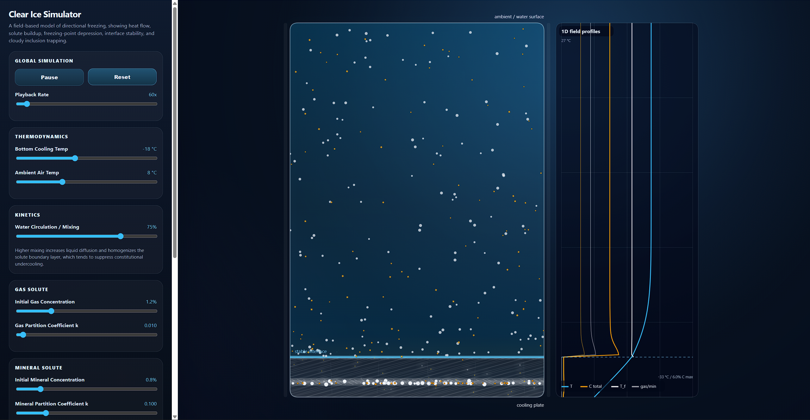
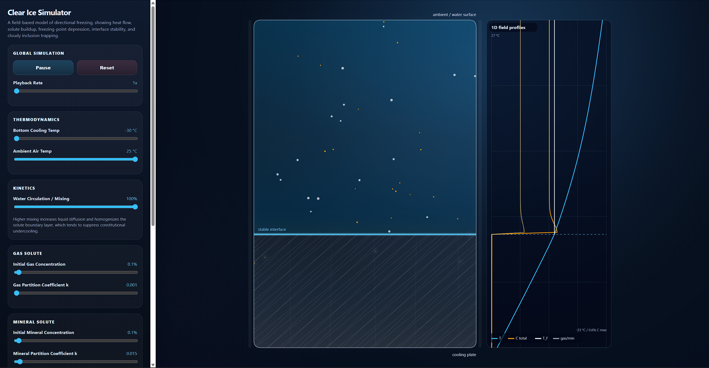
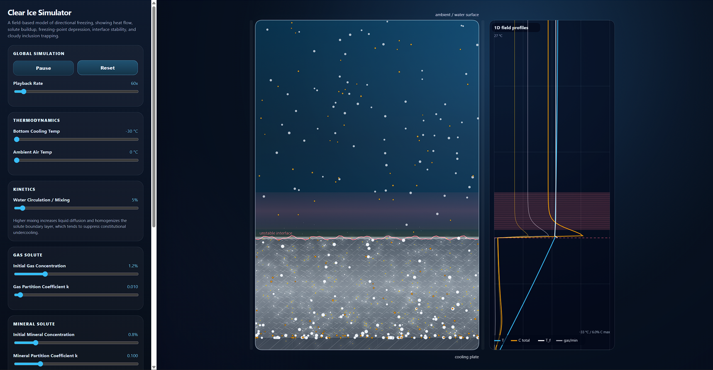
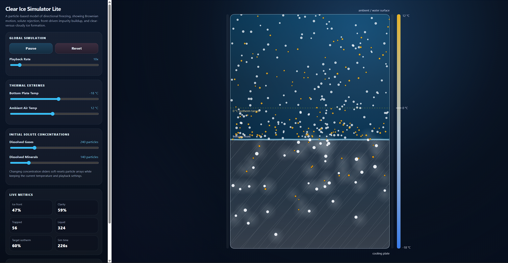
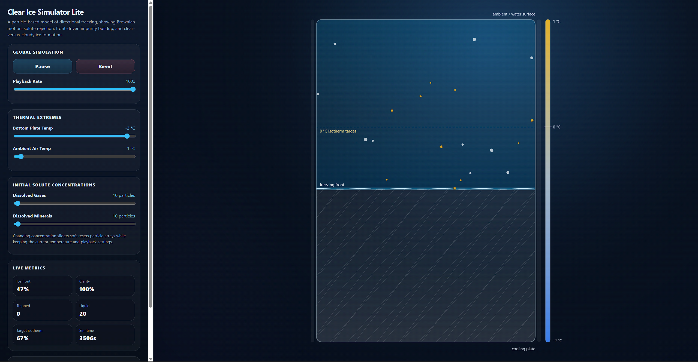
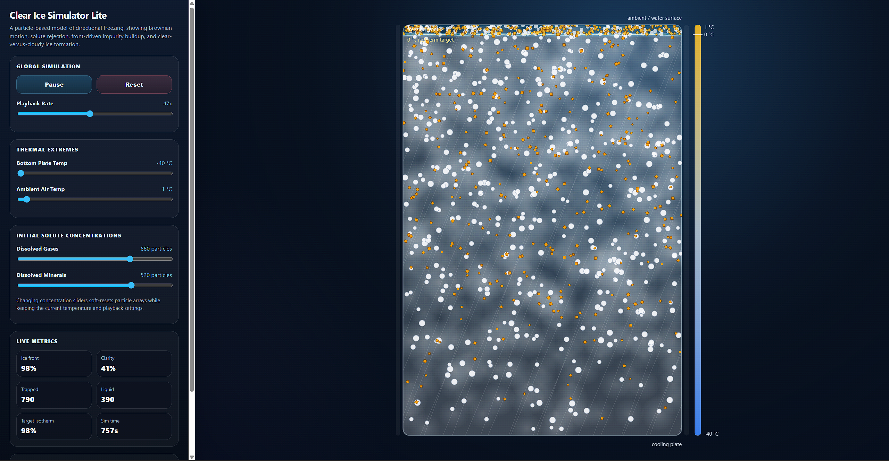

# Directional Solidification & Clear Ice Simulators

A pair of self-contained browser widgets for exploring directional solidification and the formation of clear ice.

The repository contains two simulations:

| File | Name | Best for |
| --- | --- | --- |
| `ice_sim_lite.html` | Lite / Brownian model | Fast qualitative demonstrations of impurity rejection, particle diffusion, and cloudy ice formation. |
| `ice_sim.html` | Advanced kinetics model | More physically motivated demonstrations of solute partitioning, freezing-point depression, constitutional undercooling, and morphology changes. |

Both widgets are single-file HTML applications. Each file contains its own HTML, CSS, and vanilla JavaScript. There are no external dependencies, no build process, no package manager, and no server requirement.

---

## Screenshot Gallery

### Advanced model: default interface and field graph



### Advanced model: clear ice, stable growth



### Advanced model: constitutional undercooling/strong initial transient



### Lite model: default simulation



### Lite model: clear ice



### Lite model: cloudy ice


---

## Project Overview

These widgets are designed as educational simulations of directional freezing. In directional solidification, ice grows from one side of a water volume, often from a cooled bottom plate. As the solid-liquid interface advances, dissolved gases and mineral impurities tend to be rejected into the remaining liquid rather than uniformly incorporated into the solid. Under favorable conditions, this rejection can produce clear ice. Under unfavorable conditions, solute pile-up, bubble formation, or morphological instability can trap impurities and produce cloudy ice.

The two simulators share the same broad concept but use different levels of physical detail.

`ice_sim_lite.html` is intentionally simple and visual. It treats impurities as Brownian particles moving in a liquid background while a freezing front pushes or traps them.

`ice_sim.html` is the more physical companion model. It solves one-dimensional finite-difference temperature and concentration fields, handles two simultaneous solute species, computes freezing-point depression, and detects constitutional undercooling ahead of the interface.

---

## Quick Start

1. Download or clone the repository.
2. Open either simulator directly in a modern browser:
   - `ice_sim.html`
   - `ice_sim_lite.html`
3. No server is required. Double-clicking the file is enough in most browsers.

Recommended starting point:

- Use `ice_sim_lite.html` first to build intuition.
- Use `ice_sim.html` next to explore the more physical model and field profiles.

---

## Repository Structure

```text
.
├── ice_sim.html          # Advanced kinetics simulator
├── ice_sim_lite.html     # Lite Brownian particle simulator
├── README.md             # Project documentation
├── LICENSE.md            # MIT License
└── screenshots/          # Screenshots for this README
```

Both simulator files are standalone. You can copy either HTML file by itself to another folder or computer and it will still run.

---

## Shared Features

Both widgets include:

- A single-file HTML/CSS/JavaScript implementation.
- Vanilla JavaScript only.
- HTML5 Canvas rendering.
- A sidebar control panel.
- A main simulation canvas.
- A bottom-up freezing geometry.
- Visual distinction between liquid water and solid ice.
- Gas and mineral impurity visualization.
- Play/pause and reset controls.
- Adjustable thermal settings.
- Adjustable solute settings.
- Fixed-step simulation timing so playback speed does not directly change the numerical timestep.
- An MVC-like organization inside a single file:
  - model / physics engine,
  - view / canvas renderer,
  - controller / UI bindings and animation loop.

---

# `ice_sim.html`: Advanced Kinetics Model

`ice_sim.html` is the main, more physically motivated simulation. It is intended for exploring how solute rejection, freezing-point depression, mixing, and constitutional undercooling affect whether ice grows with a stable planar interface or a rough cellular/dendritic interface.

## Advanced Model Features

The advanced model includes:

- A one-dimensional finite-difference grid along the vertical axis.
- A temperature field `T_grid`.
- Independent liquid concentration fields for gases and minerals:
  - `C_gas`
  - `C_mineral`
- Independent solid concentration fields:
  - `C_solid_gas`
  - `C_solid_mineral`
- A phase-state grid:
  - `0 = liquid`
  - `1 = solid`
- A cloudiness grid that records whether each frozen layer formed stably or unstably.
- A constitutional-undercooling check ahead of the interface.
- A smooth planar front when the interface is stable.
- A jagged rough front when the interface is unstable.
- A right-side graph showing:
  - temperature `T(y)`,
  - total concentration `C_total(y)`,
  - gas and mineral component curves,
  - solute-depressed freezing point `T_f(y)`,
  - the interface location.
- Animated particle and tracer overlays that follow the solute boundary layer.
- Faint solid-inclusion markers for incorporated solid solute.
- Brighter trapped inclusions and cloudiness during unstable growth.

## Advanced Model Controls

### Global

- **Play/Pause**: stops or resumes the simulation.
- **Reset**: restarts the fields and particles with the current slider settings.
- **Playback Rate**: speeds up or slows down simulated time using fixed physics substeps.

### Thermodynamics

- **Bottom Cooling Temp**: sets the temperature of the cooling plate.
- **Ambient Air Temp**: sets the temperature at the top boundary.

### Kinetics

- **Water Circulation / Mixing**: controls artificial mixing in the liquid. Higher mixing washes away the solute boundary layer and tends to suppress constitutional undercooling.

### Gas Solute

- **Initial Gas Concentration**: sets the initial dissolved gas concentration.
- **Gas Partition Coefficient `k`**: controls how readily gas enters the solid. Lower values mean stronger rejection.

### Mineral Solute

- **Initial Mineral Concentration**: sets the initial dissolved mineral concentration.
- **Mineral Partition Coefficient `k`**: controls how readily mineral solute enters the solid.

## Advanced Model Physics

### Domain and grid

The simulation uses a vertical one-dimensional grid from the cooling plate to the water surface.

```text
y = 0   bottom cooling plate
y = H   water surface / ambient boundary
```

The current implementation uses at least 100 vertical nodes; the working model uses 160 nodes by default.

Each grid cell stores temperature, liquid solute concentration, solid solute concentration, and phase state.

### Temperature field

The advanced model evolves temperature using an explicit finite-difference update. The bottom boundary is coupled to the cooling plate, while the top boundary is coupled to the ambient air. As the ice grows thicker, heat extraction through the bottom is reduced by a simple thermal-resistance term so that growth slows as the ice layer thickens.

Ice and water use different effective thermal diffusivities. This produces a meaningful slope change at the solid-liquid interface without forcing the temperature curve into two artificial disconnected segments.

The active interface is gently nudged toward its local liquidus temperature as a lightweight Stefan-like approximation, while older solid ice is allowed to cool by conduction.

### Concentration fields

Gases and minerals are tracked as independent one-dimensional concentration fields in the liquid:

```text
C_gas(y)
C_mineral(y)
```

In the liquid, both fields evolve by explicit Fickian diffusion:

```text
dC/dt = D * d²C/dy²
```

The mixing slider increases the effective diffusion and applies mild homogenization in the liquid region. This is not a full fluid-flow solver; it is a compact way to represent circulation washing solute away from the interface.

### Partitioning at the interface

When a liquid cell freezes, each solute species partitions independently:

```text
C_S,gas     = k_gas     * C_L,gas
C_S,mineral = k_mineral * C_L,mineral
```

The rejected remainder is deposited into the nearby liquid cells ahead of the interface, creating a solute-enriched boundary layer.

Lower `k` means stronger rejection into the liquid. Higher `k` means more solute enters the ice.

### Freezing-point depression

The local freezing point is depressed by the total solute content:

```text
T_f = -(m_gas * C_gas) - (m_mineral * C_mineral)
```

Here `m_gas` and `m_mineral` are simplified liquidus-slope parameters. They are chosen for qualitative behavior rather than calibrated quantitative prediction.

The interface can advance into the next liquid grid cell only when that cell is colder than its local solute-depressed freezing point.

### Constitutional undercooling

The model checks the liquid cells just ahead of the interface. If a real solute-enriched boundary layer has formed and the local liquid temperature lies below the local liquidus, the region is marked as constitutionally undercooled.

When constitutional undercooling is detected:

- the interface is rendered as rough and jagged,
- rejection efficiency drops,
- more particles are trapped,
- the ice layer formed during that period becomes cloudier and more opaque.

If no constitutional undercooling is detected:

- the interface remains planar,
- particles are mostly pushed forward,
- ice behind the front remains mostly transparent.

### Particle and inclusion rendering

The advanced model uses particles primarily as a visual representation of solute behavior.

There are three related visual categories:

1. **Liquid particles**: mobile gas and mineral particles in the melt.
2. **Boundary-layer tracer dots**: animated, field-sampled dots that make the concentration spike near the interface easier to see.
3. **Solid inclusions**: faint markers for incorporated solid solute, plus brighter trapped inclusions produced during unstable growth.

This distinction matters because nonzero solid concentration does not always mean a large visible bubble or mineral speck. Stable growth may incorporate a small continuum-level amount of solute while still appearing visually clear.

---

# `ice_sim_lite.html`: Lite Brownian Model

`ice_sim_lite.html` is the simpler, faster model. It is designed for intuition and demonstration rather than for detailed interface kinetics.

## Lite Model Features

The lite model includes:

- A two-dimensional particle view of the water column.
- A one-dimensional linear thermal gradient.
- A horizontal freezing front that advances upward.
- Gas particles rendered as pale circular bubbles.
- Mineral particles rendered as orange square or dot-like inclusions.
- Brownian motion in the liquid.
- Interface rejection and trapping logic.
- A clarity metric based on trapped-particle density.
- A temperature bar and front/isotherm annotations.

## Lite Model Controls

The lite model includes controls for:

- Play/pause.
- Reset.
- Playback rate.
- Bottom plate temperature.
- Ambient air temperature.
- Initial gas particle count.
- Initial mineral particle count.

Concentration sliders reset the particle population while preserving the current thermal and playback settings.

## Lite Model Physics

### Linear thermal gradient

The lite model assumes a strictly one-dimensional, perfectly linear temperature field:

```text
T(y) = T_cool + (y / H) * (T_ambient - T_cool)
```

The sides are treated as insulated, so temperature depends only on height.

### Freezing front

The nominal front target is the height where the linear temperature field reaches the freezing point:

```text
T(y) = 0 deg C
```

Solving for the target height gives:

```text
y_target = H * (0 - T_cool) / (T_ambient - T_cool)
```

The front advances toward this target at a finite rate determined by the cooling settings.

### Brownian particle motion

Particles in the liquid undergo random walk motion:

```text
sigma = sqrt(2 * D_liquid * dt)
```

The particle displacement is sampled from a normal distribution in both horizontal and vertical directions.

### Interface rejection and trapping

When the interface overtakes a particle, the model decides whether the particle is rejected forward into the liquid or trapped in the solid.

The trapping probability depends on:

- particle species,
- partition coefficient,
- local particle pile-up near the interface,
- how far the front has overtaken the particle.

Gas particles have a stronger tendency to be rejected, but dense gas pile-up can produce cloudy bubble-rich ice. Mineral particles have a higher chance of incorporation.

### Clarity metric

The lite model estimates clarity from trapped particle density. This is a heuristic visual metric rather than an optical scattering calculation.

```text
clarity = 1 / (1 + weighted trapped-particle density)
```

Gas particles are weighted more strongly because bubbles scatter light efficiently.

---

## Comparing the Two Models

| Topic | `ice_sim_lite.html` | `ice_sim.html` |
| --- | --- | --- |
| Goal | Simple, intuitive particle demo | More physical kinetics demo |
| Temperature | Linear prescribed profile | Finite-difference thermal field |
| Solute | Discrete particles only | Continuous fields plus particles |
| Solute species | Gas and mineral particles | Gas and mineral fields plus particles |
| Freezing point | Fixed at 0 deg C | Depressed by solute concentration |
| Interface motion | Advances toward target isotherm | Advances when the next cell is below local liquidus |
| Instability | Heuristic trapping/cloudiness | Constitutional-undercooling check |
| Mixing | Not explicitly modeled | Adjustable liquid mixing/circulation |
| Best use | Introductory explanation | Advanced demonstration and parameter exploration |

A useful teaching sequence is to start with the lite model to explain impurity rejection, then move to the advanced model to show why growth morphology can change when the solute boundary layer becomes constitutionally undercooled.

---

## Suggested Experiments

### 1. Clear ice in the lite model

Open `ice_sim_lite.html`.

- Set gas and mineral concentrations low.
- Use a moderately cold bottom plate.
- Watch the front push most particles upward.
- Observe the high clarity metric.

### 2. Cloudy ice in the lite model

Open `ice_sim_lite.html`.

- Increase gas concentration.
- Increase mineral concentration.
- Watch local pile-up near the front.
- Observe more trapped particles and lower clarity.

### 3. Stable growth in the advanced model

Open `ice_sim.html`.

- Use moderate solute concentrations.
- Increase water circulation / mixing.
- Use a moderate bottom cooling temperature.
- Observe a smoother planar interface and relatively clear ice.

### 4. Constitutional undercooling in the advanced model

Open `ice_sim.html`.

- Decrease mixing.
- Increase gas and/or mineral concentration.
- Use colder bottom cooling.
- Watch the boundary-layer concentration spike grow.
- Observe the undercooled region, rough front, and cloudier ice.

### 5. Partition coefficient comparison

Open `ice_sim.html`.

- Lower `k_gas` and observe stronger gas rejection into the liquid.
- Raise `k_gas` and observe more gas incorporation into the solid.
- Repeat with `k_mineral`.

### 6. Playback-rate invariance

Run either widget at different time-scale settings.

The exact particles will differ because of random sampling, but the qualitative physics should be similar at the same simulated time. The playback slider changes how quickly fixed physics steps are executed; it should not directly change the integration timestep.

---

## Architecture

Both widgets follow the same high-level organization inside a single HTML file.

### Model

The model owns simulation state and physics updates.

In the lite model, this is primarily particle arrays, a linear thermal gradient, a moving front, and trapping logic.

In the advanced model, this includes finite-difference field arrays, phase state, interface kinetics, concentration partitioning, undercooling detection, particles, and solid inclusions.

### View

The view owns canvas drawing only. It reads from the model and renders:

- water,
- ice,
- particles,
- interface shape,
- cloudiness,
- graphs and annotations.

The view should not modify physics state.

### Controller

The controller owns DOM interaction and animation timing:

- slider and button event listeners,
- label and metric updates,
- reset behavior,
- fixed-step simulation accumulator,
- `requestAnimationFrame` loop.

---

## Customization Guide

### Change default settings

In both files, look near the bottom of the script for the `new PhysicsEngine(...)` call. This is where the initial temperatures, concentrations, particle counts, and model-specific parameters are set.

### Change solute behavior in `ice_sim.html`

The advanced model defines species behavior in `speciesParams(type)`. This is where gas and mineral parameters such as partition coefficient, liquidus slope, diffusion coefficient, particle diffusivity, particle size, and cloudiness contribution are defined.

### Change particle behavior in `ice_sim_lite.html`

The lite model defines particle properties in its species-property function. This is where diffusion coefficients, partition behavior, size, and rejection distance can be adjusted.

### Change numerical timing

Both widgets use fixed-step timing. The relevant constants are near the bottom of each script. Increasing maximum steps per frame allows higher playback rates but can increase CPU load. Increasing the fixed timestep may improve speed but can reduce numerical smoothness.

---

## Browser Compatibility

The widgets use standard browser APIs:

- HTML5 Canvas,
- CSS Flexbox,
- JavaScript ES6 classes,
- `requestAnimationFrame`,
- standard range inputs and buttons.

They should run in current versions of:

- Chrome,
- Firefox,
- Safari,
- Edge.

No internet connection is required once the files are saved locally.

---

## Performance Notes

Performance depends primarily on:

- particle count,
- grid size in the advanced model,
- time-scale setting,
- display resolution,
- browser and device speed.

Both widgets cap the number of fixed physics steps that can run in one animation frame. If the browser cannot keep up, excess accumulated simulation backlog is dropped rather than converted into a larger timestep. This keeps the numerical model stable and merely slows apparent playback under heavy load.

---

## Educational Notes

These simulations are intended for qualitative learning, demonstration, and exploration. They can help explain:

- why freezing direction affects ice clarity,
- why impurities accumulate ahead of a solidification front,
- why slow, directional growth can reject solute more effectively,
- why high solute concentration can lead to cloudy inclusions,
- why mixing can reduce boundary-layer build-up,
- how solute depresses the freezing point,
- how constitutional undercooling can destabilize a planar interface.

---

## Limitations

The widgets are simplified educational models. They do not include:

- full Navier-Stokes fluid flow,
- buoyancy-driven convection,
- full Stefan-problem energy conservation,
- calibrated heat-transfer coefficients,
- pressure-dependent gas bubble nucleation,
- realistic multicomponent water chemistry,
- crystal orientation and grain-boundary dynamics,
- three-dimensional flow or particle motion,
- optical scattering from first principles,
- quantitative prediction of real freezing times or clarity.

The advanced model is more physical than the lite model, but it is still a compact browser simulation, not a validated computational materials-science solver.

---

## Credit

The code (and most of the README) herein were initially generated by ChatGPT 5.5 Thinking, based on design docs created by Gemini 3.1 Pro. Styling edits and physics fixes were implemented both manually and with assistance from the aforementioned models.